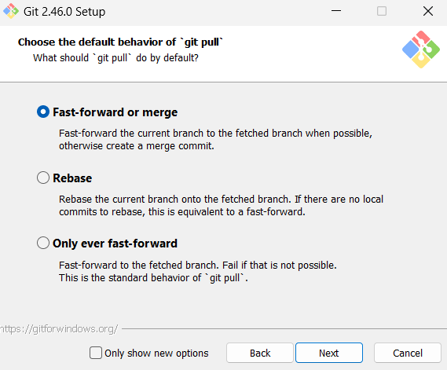

# Git 安装教程 (Windows)

## 1. 下载 Git 安装包

1. 访问 [Git 官方下载页面](https://git-scm.com/download/win)。
2. 系统会自动检测你的操作系统，并提供适合 Windows 的安装包。下载 `.exe` 文件。

   

## 2. 运行安装程序

1. 双击下载的 `.exe` 文件启动安装程序。
2. 如果系统弹出用户帐户控制（UAC）对话框，点击“是”以允许安装程序运行。

   

## 3. 安装向导配置

1. **选择安装目录**
   - 默认情况下，Git 将安装在 `D:\Git_2_37_3\Git`。你可以选择更改安装路径。
   - 点击“下一步”继续。

   

2. **选择组件**
   - 保持默认选项，通常包括 Git Bash、Git GUI、以及对 `.git` 文件的关联。
   - 点击“下一步”继续。

   

3. **确认安装目录**
   - 这个目录是 1 安装位置的子目录，不用修改
   - 安装完成后的目录：D:\Git_2_37_3\Git

4. **选择默认编辑器**
   - 选择你希望用于 Git 的默认文本编辑器。可选项包括 Vim、Nano、Notepad++ 等。选择你喜欢的编辑器。
   - 建议使用默认的编译器Vim，大部分人都用这个编译器，也是上最常用的Linux最常用的编译器。
   - 选用其他的可能需要安装对应的软件，例如选择Notepad++作为编译器,就需要先安装Notepad++ 在配置环境变量。
   - 点击“下一步”继续。

   

5. **设置主分支**
   - 设置在建立git项目的时候主分支的名字
   - 第一个是选择默认，主分支 master
   - 第二个是自定义，主分支的名字
   - 这个建议还是选择默认,因为绝大数人都用master，是否自定义看自己的需求

   

6. **调整 PATH 环境变量**
   - 主要的目的就是选择使用Git位置
   - 选择 `Git from the command line and also from 3rd-party software`，这将允许在命令提示符和其他应用程序中使用 Git。
   - 解释
     - 第一选项‘Use Git from Git Bash only’ 只在GitBash下使用（推荐）<br />
       因为使用的过程绝大多数都是通过Git Bash进行使用的，不会在其他的终端进行使用git的指令
     - 第二个选项，大概的意思就是可以在第三方软件中使用Git 会修改环境变量
     - 第三个选项 从命令提示符使用 Git 和可选的 Unix 工具 本身就带有警告
   - 点击“下一步”继续。

   

7. **选择ssh协议**
   - 这个在使用代码托管平台（GitHub，Gitee）的时候会用到，选择默认的就可以

   

9. **选择 HTTPS 传输后端**
   - 选择 `Use the OpenSSL library` 选项。
   - 点击“下一步”继续。

   

10. **配置行结束符转换**
   - 如何处理文本行最后的换行符，因为linux和windowd的换行符不一样 分别（CRLF, LF)
   - 使用默认就可以，`Checkout Windows-style, commit Unix-style line endings` 选项，以支持跨平台开发。会将换行符自动转换成Linux中的
   - 点击“下一步”继续。

   

11. **选择终端模拟器**
   - 选择 `Use MinTTY` 选项，这是默认的终端模拟器，提供更好的终端体验。
   - 点击“下一步”继续。

   

12. **提交代码采用的策略**
    - 当提交的内容出现冲突的时候，采用什么样的形式进行合并，使用默认的就可以

   

13. **选择凭据管理器**
   - 选择凭据管理器，以前的版本有三个选项，使用默认就行。
   - 根据需要启用或禁用其他选项，如 `Enable file system caching` 和 `Enable Git Credential Manager`。
   - 点击“下一步”继续。

   

14. **其他配置**
    - 其他配置 建议都选上
    - 文件缓存机制会提高性能（file system caching），但是可能会占用更多的磁盘空间。
    - 符号链接(sysbolic links)

   

15. **实验功能**
    - 实验室功能，功能不稳定，有bug，初学者也用不上，不建议勾选

   

16. **安装中**
    
    

17. **完成安装**
   - 根据自己的需要决定
   - 解释：
     - Launch git Bash: 启动 Git Bash。
     - View Release Notes: 查看 Git 版本更新信息。
   - 安装完成后，点击“完成”退出安装向导。

   

## 4. 验证 Git 安装

1. 打开 **Git Bash**（在鼠标右键显示更多菜单中找到 Git Bash）。
   
   

2. 输入以下命令来验证 Git 是否安装成功：

    ```bash
    git --version
    ```
    
   

   如果安装成功，你会看到类似 `git version 2.x.x` 的版本信息。


## 5. 配置 Git

1. 在 Git Bash 中设置你的Github/Gitee用户名和电子邮件地址，这些信息将用于标记你的提交记录：

    ```bash
    git config --global user.name "你的名字"
    git config --global user.email "你的邮箱"
    ```

2. 你可以通过以下命令查看配置是否正确：

    ```bash
    git config --list
    ```

   

## 6. 常见问题

- **安装过程中出现错误**
  - 确保下载的安装包没有损坏。尝试重新下载并运行。

- **Git 命令无法识别**
  - 确保 Git 的安装目录已添加到系统的 PATH 环境变量中。如果没有，可能需要手动添加。

## 7. 参考资料

- [Git 官方文档](https://git-scm.com/doc)
- [Git 配置指南](https://git-scm.com/book/zh/v2/设置-Git-配置)
