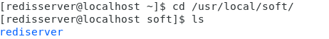
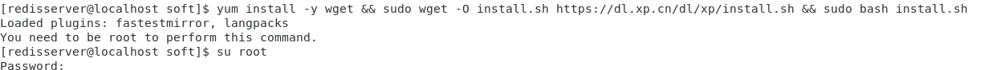
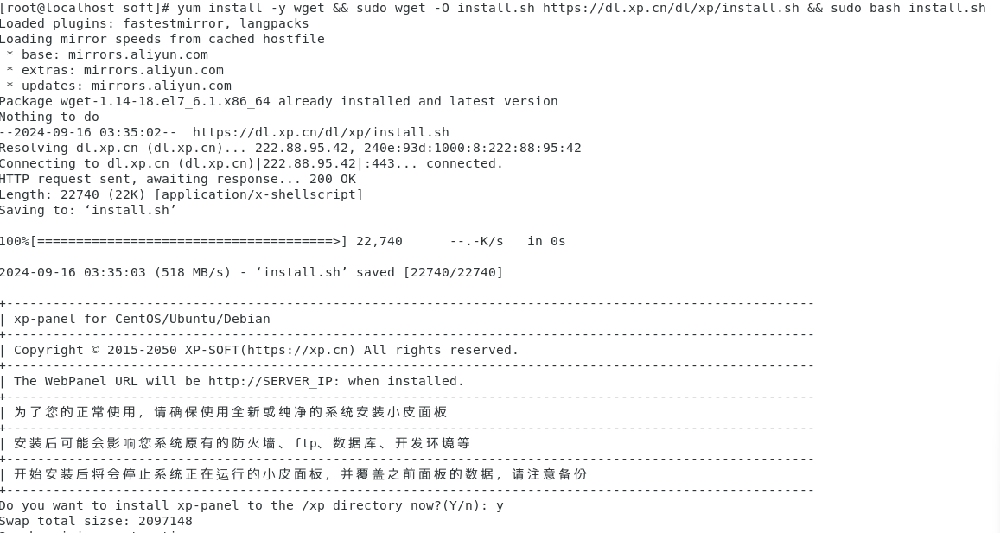
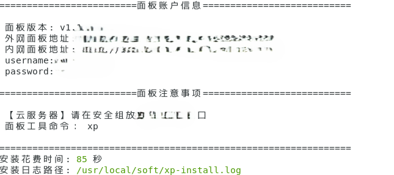
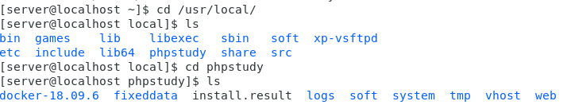
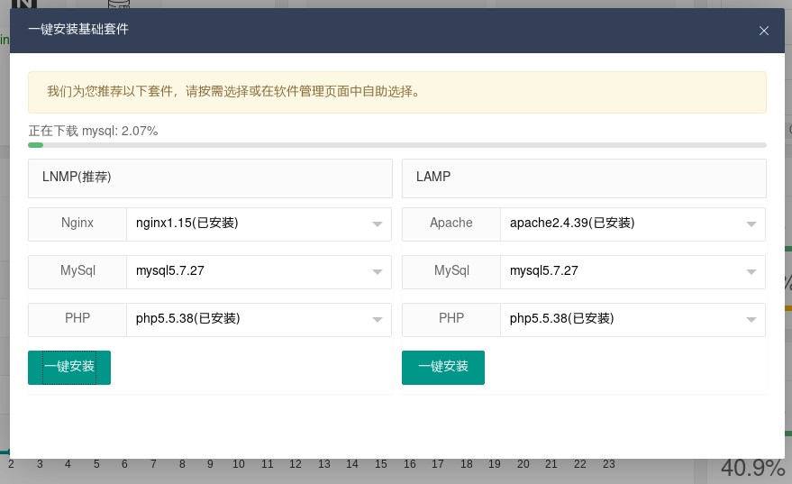
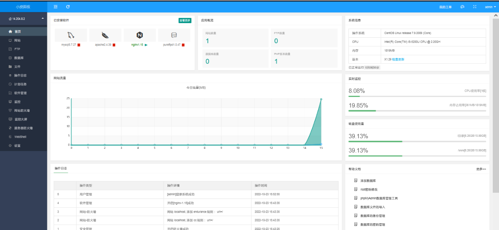
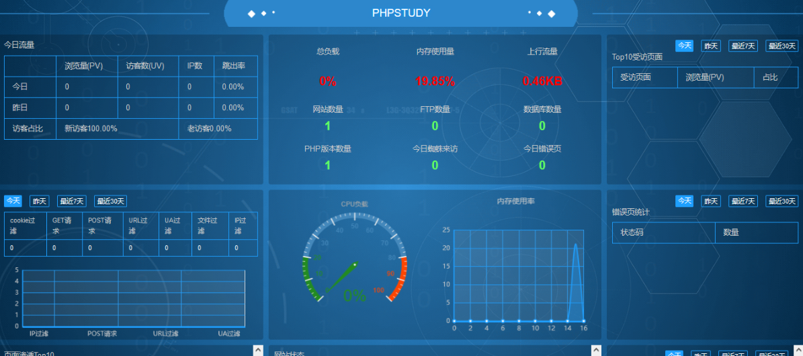
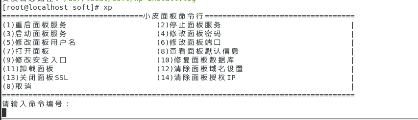

# Phpstudy(Centos7)安装及使用

## 一、Introduction
1. Phpstudy是一款集成环境，可以用来进行Web开发、PHP开发、数据库管理、服务器管理等。本文将介绍Phpstudy的安装及使用方法。

2. PhpStudy 国内12年老牌公益软件，集安全，高效，功能与一体，已获得全球用户认可安装，运维也高效。支持一键LAMP,LNMP,集群,监控,网站,FTP,数据库,JAVA等100多项服务器管理功能。

## 二、注意事项
1. 操作系统：全新系统(支持CentOS、Ubuntu、Debian、Fedora、Deepin)等

2. 请确保您的系统是纯静的,未安装任何环境中涉及到的（Apache\Nginx\php\MySQL\FTP）

3. phpstudy for linux 采用为Docker核心而开发，故此建议使用centos7.xx 系统版本

4. 内存要求：内存要求最低512MB，推荐768MB以上，纯面板约占系统60MB内存

## 三、安装Phpstudy
0. 安装脚本
```bash
无docker版本
Centos安装脚本 yum install -y wget && wget -O install.sh https://notdocker.xp.cn/install.sh && sh install.sh

Ubuntu安装脚本 wget -O install.sh https://notdocker.xp.cn/install.sh && sudo bash install.sh

Deepin安装脚本 wget -O install.sh https://notdocker.xp.cn/install.sh && sudo bash install.sh

Debian安装脚本 wget -O install.sh https://notdocker.xp.cn/install.sh && sudo bash install.sh
```

```bash
有docker版本
Centos安装脚本 yum install -y wget && wget -O install.sh https://download.xp.cn/install.sh && sh install.sh

Ubuntu安装脚本 wget -O install.sh https://download.xp.cn/install.sh && sudo bash install.sh

Deepin安装脚本 wget -O install.sh https://download.xp.cn/install.sh && sudo bash install.sh

Debian安装脚本 wget -O install.sh https://download.xp.cn/install.sh && sudo bash install.sh
```
### ***补充说明：***
**什么是Docker?**
Docker 是一个开源的应用容器引擎，让开发者可以打包他们的应用以及依赖包到一个可移植的镜像中，然后发布到任何流行的 Linux或Windows操作系统的机器上，也可以实现虚拟化。容器是完全使用沙箱机制，相互之间不会有任何接口。

1.打开终端，切换到指定目录
```bash
cd /etc/usr/local/
```



2. 切换root用户
```bash
su root
```
***注意：***
如果没有切换到root用户，那么下一步系统会报错提醒你没有权限执行安装脚本。



3. 执行安装脚本命令
```bash
yum install -y wget && wget -O install.sh https://download.xp.cn/install.sh && sh install.sh
```



***注意：***
执行安装脚本的另外一个前提是进行yum换源，如果没有进行yum换源，系统也有可能会提示报错。

4. 安装完成
   1. 这时候他会给你一个内网地址和外网地址（我仅是在虚拟机搭建的环境，所以我外网地址是没用的）
   2. 接下来打开浏览器，接着复制这段内网地址到搜索栏打开，进入后台管理界面



***注意：***
账号密码为刚刚生成的默认账号和密码，后期可以进行修改。

5. 查看phpstudy目录
```bash
cd /usr/local/phpstudy/
ls
```


## 四、Phpstudy使用
1. 安装套件
进入之后会提示安装套件，一些基本套件已经安装，就差Mysql数据库了，点击一键安装）：



2. 安装完成后面板展示



3. phpstudy的炫酷大屏



4. centos7系统的phpstudy的命令行
**前提：root用户**
```bash
su root
```

```bash
xp
```

