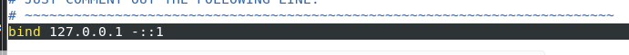
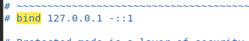

# Centos7源码方式安装Redis

## 0. 前言
### 0.1 Linux软件安装方式简介
同一个软件有很多种不同的安装方式，Linux操作系统中安装软件有几种常见方式：
1. 源码编译安装：一般需要解压然后用make 、make install等命令，这种方式步骤比较复杂，编译时间长，而且结果不可控
2. RPM（RedHat Package Manager）是一个软件管理包，安装卸载变得简单了，但是无法解决软件包之间的依赖关系问题
3. YUM（Yellow dog Updater, Modified）是一个RPM的前端程序，可以自动解决软件的依赖关系。但是要注意版本的问题，默认从仓库中获取安装的不一定是最新版本
4. 不需要安装只要配置环境变量的（解压就可以使用）

### 0.2 说明
以下操作全部用root用户进行，适合用虚拟机的测试环境，不适合生产环境

### 0.3 前提条件
因为要下载软件，所以必须要能正常连接外网。
```bash
ping baidu.com
```

如果不通，需要检查网络。
[网络排查errors&solutions/1.1.virtual_machine/Centos7配置静态IP问题排查.md](../../../errors&solutions/1.1.virtual_machine/Centos7配置静态IP问题排查.md)

此外，因为要用yum安装软件，必须把yum源替换为阿里云源。
[Centos7配置阿里云yum源VMware/Virtual_Machine/Centos换源教程.md](../VMware/Virtual_Machine/Centos换源教程.md)

### 0.4 准备工作
在目标位置创建软件安装目录soft【专门用于软件安装】
```bash
cd /usr/local/
mkdir soft
cd soft/
mkddir rediserver
```


## 一. 下载Redis源码
- 官网：[https://redis.io](https://redis.io)
- 下载地址：[https://download.redis.io/releases/](https://download.redis.io/releases/)

1. 找到目标版本【测试使用6.0.9】，选中目标版本，右键复制链接地址。


```bash
cd /usr/local/soft/rediserver/
curl -O https://download.redis.io/releases/redis-6.0.9.tar.gz
```

<br />


2. 解压Redis源码
```bash
tar -zxvf redis-6.0.9.tar.gz
```


3. 删除压缩包
```bash
rm -rf redis-6.0.9.tar.gz
```


## 二. 确定gcc版本【一般没有问题，如果下一大步出现问题可以从这里开始】
1. Redis需要gcc版本大于等于4.8，查看gcc版本
默认的gcc 4（gcc version 4.8.5 20150623 (Red Hat 4.8.5-44) (GCC) ）版本会报错。这里需要升级到gcc9。
```bash
gcc --version
```

2. 安装SCL源
没有安装SCL源，会提示找不到GCC软件包


```bash
yum install centos-release-scl centos-release-scl-rh -y
```

显示一下内容，就表示安装成功：


**注意：可能会报错yum install报错Cannot find a valid baseurl for repo: centos-sclo-rh/x86_64**
解决方法：[yum install报错Cannot find a valid baseurl for repo: centos-sclo-rh/x86_64](../../../errors&solutions/2.0.yum/yum%20install报错1.md)

3. 安装GCC相关工具
```bash
yum install devtoolset-9-gcc devtoolset-9-gcc-c++ devtoolset-9-binutils -y
```

看到一下内容就是安装成功：


4. 启用GCC9
```bash
echo "source /opt/rh/devtoolset-9/enable" >> /etc/profile
source /opt/rh/devtoolset-9/enable
```

5. 再次查看GCC版本
```bash
gcc --version
```


## 三. 编译安装Redis

1. 进入Redis源码目录
```bash
cd /usr/local/soft/rediserver/redis-6.0.9
```

2. 编译Redis
```bash
make
```
编译完成后，在/usr/local/redis-6.0.9/src目录中多了两个可执行文件redis-cli和redis-server。
- redis-cli：Redis命令行客户端，用于连接本机或者其他机器的Redis服务。
- redis-server：Redis服务器
<br />

<br />

/usr/local/bin目录中也多了几个可执行文件


## 四、修改配置文件
配置文件也在redis-6.0.9目录下
**注意，如果不在redis-6.0.9/目录下，就在redis-6.0.9/src目录下，后续命令对应改成/usr/local/redis-6.0.9/src/redis.conf**

如果找不到可以搜一下：
```bash
find / -name redis.conf
```

编辑命令
```bash
vim /usr/local/soft/rediserver/redis-6.0.9/redis.conf
```

**有三处必须要修改**

1. 设置后台启动
- 查找daemonize：进入编辑页面后先不要进入编辑模式
- 先输入/，在输入daemonize，回车来进行搜索
- 找到daemonize，将no改成yes，保存不退出
- 
<br />

<br />

<br />

2. 取消本机访问
- 找到bind：修改daemonize后先不要退出
- 输入/，在输入bind，回车来进行搜索
- 找到bind，将127.0.0.1改成0.0.0.0，或者直接在改行最前面添加#注释掉
- 保存不退出

<br />

<br />

<br />

1. 取消保护模式
- 找到protected-mode：修改bind后先不要退出
- 输入/，在输入protected-mode，回车来进行搜索
- 找到protected-mode，将yes改成no，保存不退出

<br />

<br />

<br />

1. 设置写入磁盘规则【可选】
- 找到SNAPSHOTTING：修改protected-mode后先不要退出
- 输入/，在输入SNAPSHOTTING，回车来进行搜索
- 找到SNAPSHOTTING，取消三行任意一行注释，也可以全部取消，不论取消哪一条都会生效

<br />

<br />

<br />

1. 保存退出
- 按一下esc键退出编辑模式
- 输入:wq保存退出

## 五、启动Redis服务
1. 完整的启动命令，必须要指定使用的配置文件：
```bash
/usr/local/redis-6.0.9/src/redis-server /usr/local/redis-6.0.9/redis.conf
```
2. 查看6379端口是否启动成功
新开一个命令窗口
```bash
netstat -anp | grep 6379
```


## 六、测试Redis服务
1. 以下命令可以直接连接到本机已经启动的redis服务。
```bash
/usr/local/redis-6.0.9/src/redis-cli
```
2. 如果要连接到其他机器的redis，需要指定IP端口：
```bash
/usr/local/redis-6.0.9/src/redis-cli -h 目标机器IP -p 6379
```

## 七、停止Redis服务
停止Redis服务的方法：
- 连接到服务端
- 输入shutdown命令
- exit退出客户端


# 八、配置别名快速启动redis服务
1. 打开bashrc配置文件
```bash
vim ~/.bashrc
```

1. 在文件末尾添加以下内容：
```bash
alias redis-start='/usr/local/redis-6.0.9/src/redis-server /usr/local/redis-6.0.9/redis.conf'
alias redis-cli='/usr/local/redis-6.0.9/src/redis-cli'
```
**注意：这里的路径根据自己的实际情况进行修改,redis-start\redis-cli为自己起的别名**

2. 保存退出
- 按一下esc键退出编辑模式
- 输入:wq保存退出

3. 编译刷新bashrc配置文件
```bash
source ~/.bashrc
```

4. 使用redis-start快捷启动redis服务，redis-cli连接redis服务【但是不可以指定IP端口】


