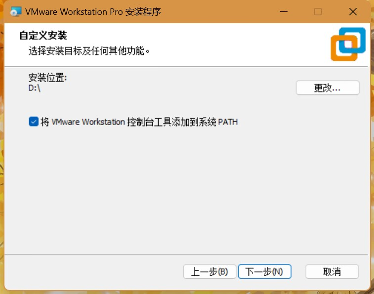
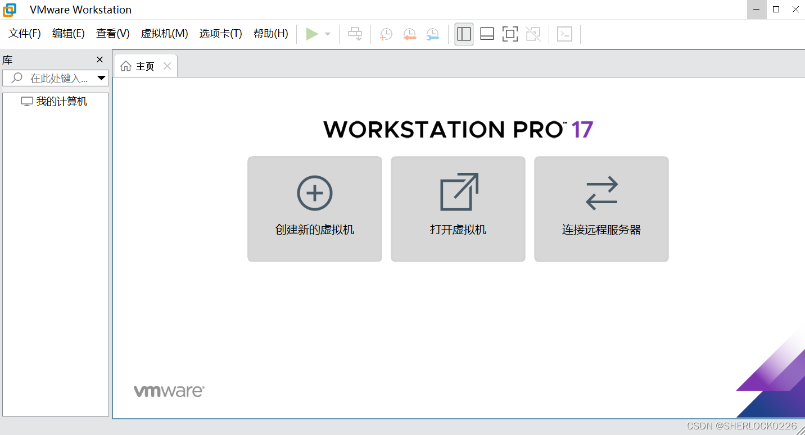

# VMware

## Introduction
VMware是一家专注于计算机虚拟化软件的领先企业，成立于1998年，总部在美国加州。 
通过其核心产品如vSphere和Workstation，VMware支持在多个操作系统间实现无缝切换，是开发、测试和部署新应用的理想工具。 
它的网络虚拟化平台NSX可以创建复杂网络拓扑，而vRealize Automation则实现IT服务的自动化交付。 
VMware与全球科技巨头如阿里云和亚马逊AWS合作，为企业提供全面的虚拟化和云计算解决方案，推动企业数字化转型。

## 拓展——虚拟机(Virtual machine)
虚拟机(VM)是一种在一台物理服务器上运行的软件，它模拟了完整的硬件系统，并拥有自己的操作系统、应用、文件系统和网络接口。 
VM可以运行各种操作系统，包括Windows、Linux、macOS等。VM可以像真实的物理机器一样使用，可以运行各种软件， 
包括Web服务器、数据库服务器、业务应用等。VM可以随时启动、关闭、暂停、恢复，可以迅速扩容或缩容，可以实现高可用性。

## 系统要求
- Windows
  - 操作系统：Windows 10、Windows 11（64位）
  - 处理器：支持虚拟化技术的处理器（Intel VT-x或AMD-V）
  - 内存：4 GB RAM（推荐8 GB或更多）
  - 硬盘：至少 1 GB 的可用磁盘空间用于 VMware Workstation 的安装，额外的磁盘空间用于虚拟机
- Linux
  - 操作系统：多种Linux发行版（如Ubuntu、CentOS、Fedora等）
  - 处理器：支持虚拟化技术的处理器（Intel VT-x或AMD-V）
  - 内存：4 GB RAM（推荐8 GB或更多）
  - 硬盘：至少 1 GB 的可用磁盘空间用于 VMware Workstation 的安装，额外的磁盘空间用于虚拟机

## 安装(Installation)
### 一、在 Windows 上安装 VMware Workstation Pro
- 1、下载 VMware Workstation Pro
(1) [官网登陆](https://support.broadcom.com/group/ecx/productdownloads?subfamily=VMware%20Workstation%20Pro)将自动跳转至登陆界面，需注册账号并登录才可以访问该网址（username是注册时用的邮箱）

(2) 登录后，重新打开第（1）步中的网址，选择最新版17.5.2，如下图所示：

- 2、双击下载的 .exe 文件启动安装程序。
点击“下一步”开始安装向导。

- 3、阅读许可协议并选择“我接受协议”。
点击“下一步”。

- 4、更改兼容性设置【勾选】
点击“下一步”

- 5、选择是否要加入VMware客户体验改进计划。【否】

- 6、选择要安装VMware的文件夹【除了C盘自己指定文件夹】。
点击“下一步”。

- 7、将控制台工具添加到系统PATH【勾选】
点击“下一步”

- 8、选择要安装的组件（如VMware Workstation Pro、快捷方式等）。
点击“下一步”。

- 9、安装完成后，打开vmware, 勾选"个人用途"（个人用途免费，无需许可证）。
- 点击"继续"，如下图所示:

- 10、启动 VMware Workstation Pro。

