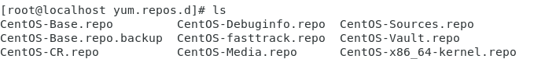

# CentOS 7 换源为阿里源详细教程

## 前言
1. yum 是一个在 Linux 系统中进行包管理的工具，它可以从指定的服务器自动下载安装包并管理软件包。
2. 更换yum源原因：通常，Linux的发行版，比如CentOS这样的操作系统，我们在使用的时候，安装软件非常的慢，这是因为CentOS默认的yum源不是国内镜像，所以yum在安装或更新的时候网络速度很慢，甚至会提示Could not resolve host:mirrorlist.centos.org: Unkown error的问题。


## 一. 备份原有的源配置

1. 官方的yum源配置文件位置：
```bash
/etc/yum.repos.d/CentOS-Base.repo  
```

2. 查看官方yum源配置文件内容：
```bash
sudo cat /etc/yum.repos.d/CentOS-Base.repo
```


1. 备份原有的源配置：
在进行任何修改之前，建议先备份当前的源配置，以防止出现问题时可以恢复。

```bash
sudo mv /etc/yum.repos.d/CentOS-Base.repo /etc/yum.repos.d/CentOS-Base.repo.bak
```

进行备份后可以看到CentOS-Base.repo.bak文件已经生成。


2. 删除旧的源配置【可选】【不推荐】

删除原有的 CentOS 源配置文件（可选步骤，取决于您是否需要保留旧配置文件）。  
```bash
sudo rm -f /etc/yum.repos.d/CentOS-Base.repo
```

## 二.添加阿里云源

1. 下载阿里云 CentOS 7 源的 yum 源配置文件：
```bash
curl -o /etc/yum.repos.d/CentOS-Base.repo http://mirrors.aliyun.com/repo/Centos-7.repo
```


2. 验证阿里云源是否可用：
```bash
sudo yum makecache fast
```


3. 验证是否成功切换到阿里云源：
```bash
sudo yum repolist
```

4. 再次查看 yum 源配置文件内容如下：
```bash
cat /etc/yum.repos.d/CentOS-Base.repo
```


## 三、清理缓存并生成新的缓存

```bash
sudo yum clean all
sudo yum makecache
```

如果出现"Failed connect to mirrors.aliyuncs.com:80; Connection refused"的错误，重试即可。

## 四、更新软件
注意：这一步会更新操作系统中所有软件到最新版，不是必要操作。而且网速慢的情况下，会非常耗时，谨慎操作。

命令：
```bash
sudo yum update
```

如果要中断更新，可以使用Ctrl+C命令。

## 五、 其他常用源

- 腾讯云源：http://mirrors.cloud.tencent.com/
- 网易源：http://mirrors.163.com/
- 华为源：https://mirrors.huaweicloud.com/
- 阿里源：http://mirrors.aliyun.com/
- 首都在线源：http://mirrors.yun-idc.com/

