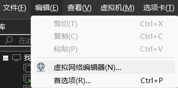

# Centos静态IP配置教程

## 一.准备工作
1. 确认Centos系统已经安装好，并且可以正常使用。
2. 查看物理机IP地址
```powershell
ipconfig -all
```
- 首先要确定你的上网方式是有线还是无线。
- 如果你的电脑用的是有线网络（插了网线），就找到“以太网适配器 以太网”的IPv4地址：


比如 192.168.142.3.10(后面的步骤会用到)

- 如果是无线网络（WiFi上网），则找到“无线局域网适配器WLAN”的IPv4地址：


比如：10.160.18.51(后面会用到)

## 二、虚拟网络设置

1.首先是网络模式设置，点击虚拟机，编辑虚拟机设置



2.选择“网络适配器”选项卡，选择“自定义——VMnet8（NAT模式）”


3. 虚拟网络编辑器设置


**注意：此时是无法进行修改的，需要管理员权限**
点击右下角的“更改设置”，窗口会重新打开
有三个地方需要修改：
- 子网IP（虚拟机网段）
- NAT网段
- DHCP网段

4. 子网IP设置
x.x.x.x的四位IP中，虚拟机和物理机的前两位IP保持一致，第三位必须和物理机不同。
**注意：子网IP的最后一位必须是0，不要动！**


5. NAT网段设置
NAT设置，IP第三位和子网保持一致，网关最后一位必须是2


6. DHCP网段设置
DHCP设置，IP第三位和子网保持一致，最后一位保持默认即可
**注意：DHCP网段的最后一位必须是254，不要动！**
**注意：设置虚拟机IP地址必须在子网IP的范围内！**


## 三、Centos网络配置文件

1. 启动虚拟机，切换到root身份(必须是root用户，否则没有修改配置的权限)
```bash
su root
```

2. 编辑网络配置文件
可以直接复制，然后在命令行中“ctrl+shift+v”粘贴
```bash
vi /etc/sysconfig/network-scripts/ifcfg-ens33
```

如果弹出下面这个窗口，说明你之前没有保存就退出了，或者有多个窗口在同时操作ens33文件。


临时解决办法很简单：按E或Enter继续编辑。
根本解决办法：删掉这个临时文件，下次就没有提示了：
```bash
cd /etc/sysconfig/network-scripts/
rm -rf .ifcfg-ens33.sw*
```

对于第一次使用vi编辑器的同学来说，需要注意：
VI有两种模式，一种是“命令模式”，可以执行命令，一种是“编辑模式”，可以修改文本。
当我们用vi打开文本的时候，是命令模式，不能修改文本。
这个时候需要按“i”进入编辑模式。

此时左下角出现-- INSERT --提示。我们用键盘上下左右键，移动光标，到需要修改的位置。

3. 修改配置文件
- BOOTPROTO需要改成static
- ONBOOT改成yes
**注意；不要把static敲错**


4. 添加IPADDR/NETMASK/DNS1/GATEWAY


```bash
IPADDR=10.160.20.188
NETMASK=255.255.255.0
DNS1=114.114.114.114
GATEWAY=10.160.20.2
```
- 1. 静态IP地址IPADDR,网段跟物理机不同即可。比如物理机的IP是10.160.18.51，配置的子网IP是10.160.20.0，那么虚拟机的IP地址可以设置成10.160.20.131， （最后一位随便写，建议从130以后开始）
- 2. 子网掩码NETMASK,固定255.255.255.0
- 3. DNS1固定 114.114.114.114
- 4. 网关GATEWAY,最后一位必须是2，前三位跟IPADDR一致

5. 保存并退出
上面的操作都是在编辑模式中进行的。
如果不小心改错了，想要放弃修改怎么办？这个时候需要按Esc回到命令模式。
在命令模式下，左下角的-- INSERT --消失了。
如果放弃修改重来，输入以下命令（注意全部是英文符号），回车

```bash
:q!
```


如果要保存修改的结果，输入（英文符号），回车

```bash
:wq
```


## 四、重启网络服务
网络配置文件修改以后，需要重启网络才能生效
**注意：修改配置文件后都需要修改相应的服务，配置才会生效**
```bash
systemctl restart network
```

**注意：如果重启网络失败，大概率是配置文件内容错误，请按文章开头的链接排查**

查看网络是否生效，查看ens33的IP地址是否是我们设置的IP地址
```bash
ifconfig
```


## 五、测试网络
检验静态IP是否配置成功，需要同时满足一下三条
- 1.虚拟机可以ping通baidu.com
- 2.虚拟机可以ping通物理机的IP地址
- 3.虚拟机可以ping通虚拟机的IP地址

1. 测试虚拟机是否能访问互联网（ctrl+c退出）
```bash
ping baidu.com
```


**注意：卡住了，或者提示Name or service not known，是网络不通或者DNS配置错误**

2. 测试虚拟机是否能ping通物理机的IP地址
```bash
ping 物理机IP地址
```


3. 测试物理机是否能ping通虚拟机的IP地址 
```bash
ping 虚拟机IP地址(刚才配置的IPADDR)
```


卡住了，或者请求超时，说明物理机和虚拟机网络不通

### 如果三条均满足，说明静态IP配置成功！

六、 问题排查

参考[errors&solutions\1.1.virtual_machine\Centos7配置静态IP问题排查.md](../../../../errors&solutions/1.1.virtual_machine/Centos7配置静态IP问题排查.md)

