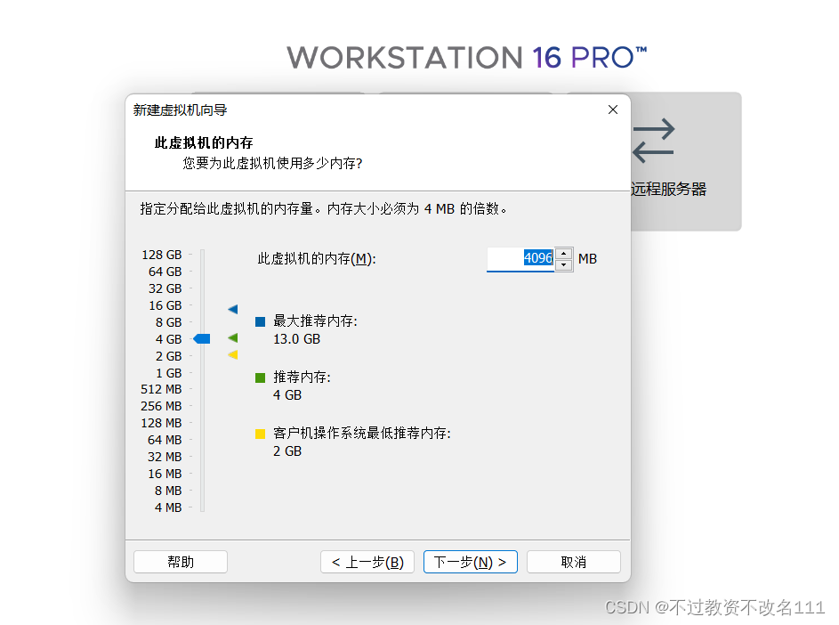

# Kail

## 介绍(Introduction)
Kail 是一个 Kubernetes 日志查看器，可以帮助你实时查看 Kubernetes 集群中 pod 的日志。Kail 可以帮助你过滤日志，并实时监控 pod 的日志。

## 安装(Installation)
### 一、镜像下载
镜像下载链接：[清华源Kail镜像](https://mirrors.tuna.tsinghua.edu.cn/kali-images/kali-2024.3/kali-linux-2024.3-installer-arm64.iso)

### 二、安装Kail
1. 打开VMware首页，创建新的虚拟机

2. 新建虚拟机向导，选择“自定义”，选择“下一步”

3. 硬件兼容性，默认配置，选择“下一步”

4. 选择 “安装程序光盘映像文件” 通过浏览目录选择刚刚下载的镜像文件，然后“下一步”

5. 给虚拟机起一个名字(如Kail)，选择位置

   1. 注意：由于解压生成的镜像文件很多，这里需要我们自建一个文件夹，然后再选中自建文件夹
6. 选择客户机操作系统-“Kail”，版本“Ubuntu”，选择“下一步”

7. 处理器数量和处理器内核数量、虚拟机内存 按照需求自定义，后期可以更改（建议默认）

   1. 注意：一般来说，虚拟机处理器内核总数不能超过宿主机的内核数
8. 为虚拟机分配内存，建议不要超过提示的最大推荐内存，这里分配2GB（2048MB）。

   1. 注意：虚拟机内存不能超过宿主机的内存（本宿主机内存为16GB）
9.  网络适配器类型，默认选择“NAT”进行网络连接

10. 选择I/O空机器类型，默认配置“LSI Logic”，选择“下一步”

11. 选择磁盘类型，默认配置“SCSI”，选择“下一步”

12. 选择磁盘，默认选择“创建新虚拟磁盘”，选择“下一步”

13. 指定磁盘容量，选择“将虚拟磁盘存储为单个文件”，最大磁盘大小“20.0”

    1.  注意：这里的最大磁盘大小20GB是该客户机允许的最大磁盘容量，并不是实际的使用量
14. 一直“下一步”，直到完成

15. 开启虚拟机
16. VMware下方会有黄色小框“我已完成安装”
17. Kail LInux installer menu，默认“Graphical install”直接回车

18. 选择语言，推荐“英语”（如果基础不好可以选的汉语）

19. 选择时区，“中国”

20. 配置键盘，“汉语”

21. 配置网络，域名可以不填，直接下一步

22. 选择“设置用户名和密码”

23. 磁盘分区，选择“使用整个磁盘”，然后“下一步”

24. 分区设定，“将所有文件放在同一个分区”

25. 分区设定，“结束分区设定并将修改写入磁盘”

26. 安装GRUB启动引导器

27. 安装基本系统【等待】

28.  软件选择，可以全选也可以选择部分，但是“Xfce”必选

29. 安装GRUB启动引导器，选择“/dev/sda”作为启动盘

30. Successfuly

