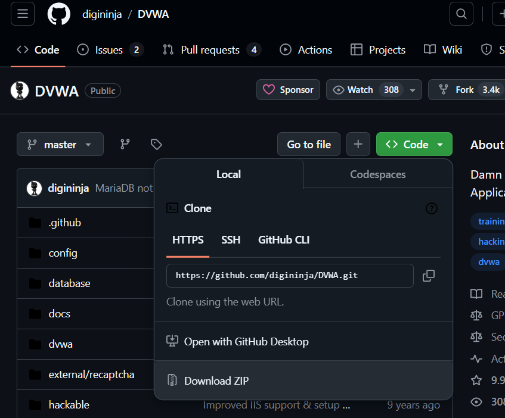
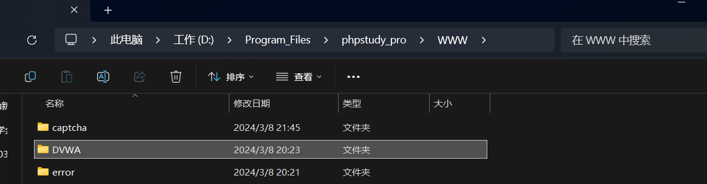
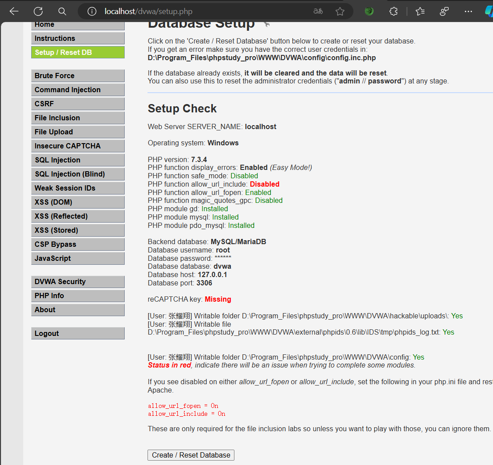
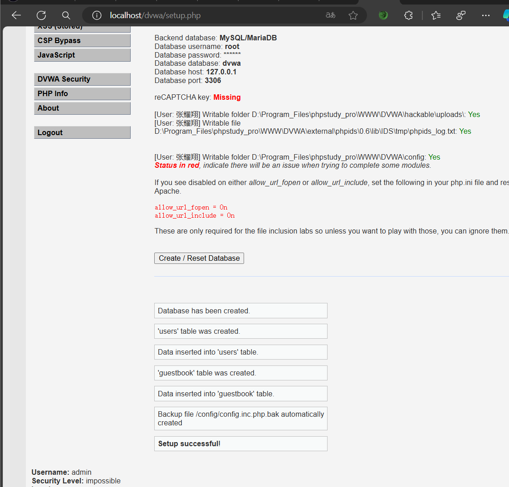
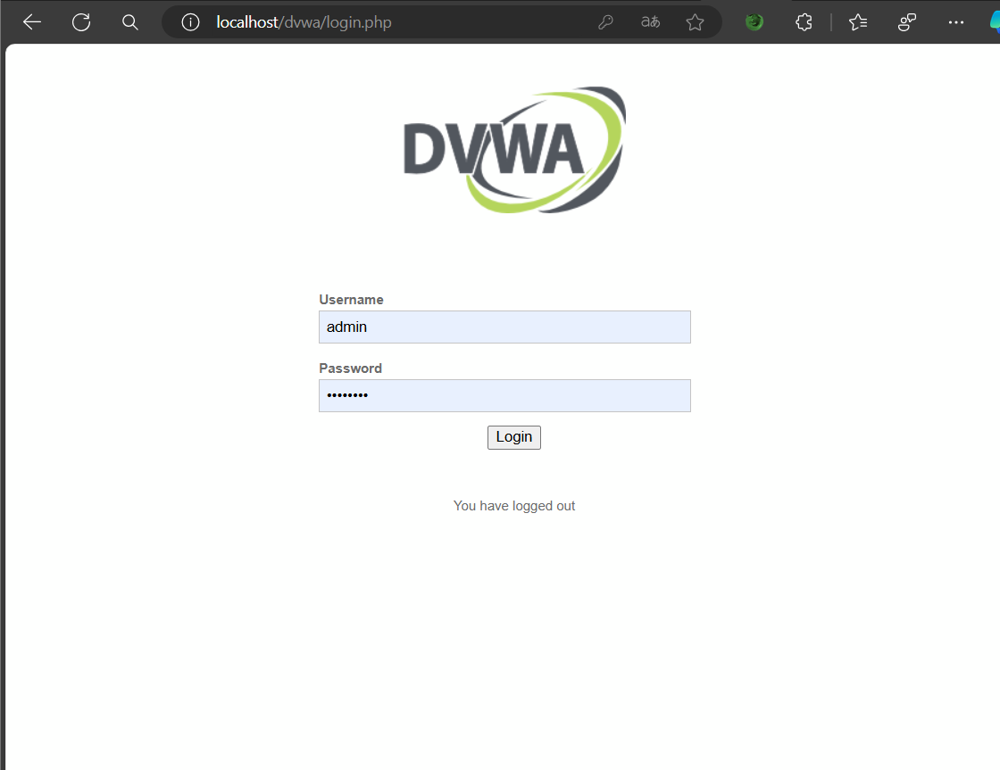
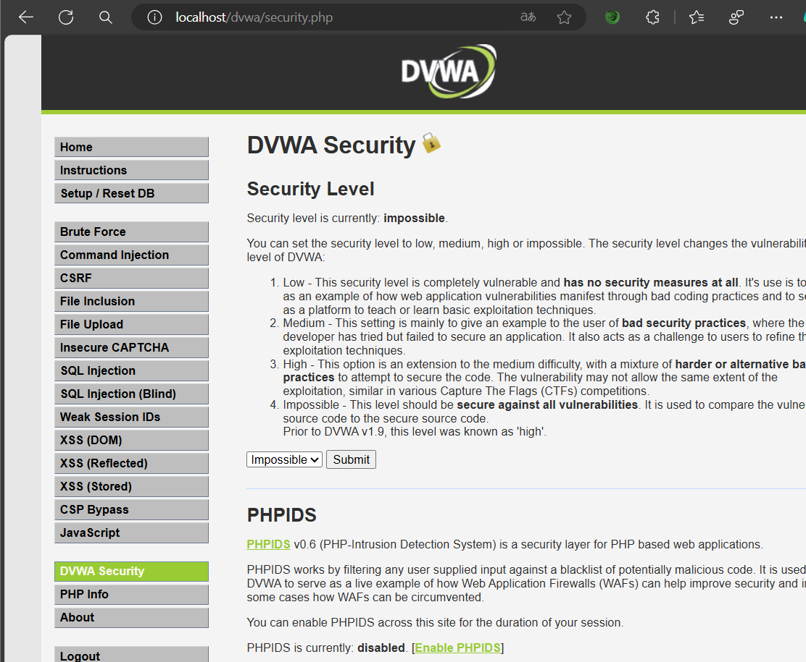

# DVWA installation and configuration

## Introduction
1.DVWA（Damn Vulnerable Web Application）是一个用来进行安全脆弱性鉴定的PHP/MySQL Web应用,   

旨在为安全专业人员测试自己的专业技能和工具提供合法的环境，帮助web开发者更好的理解web应用安全防范的过程。   


2.十级模块：    

暴力（破解）、命令行注入、跨站请求伪造、文件包含、文件上传、不安全的验证码、SQL注入、    

SQL盲注、弱会话ID、XSS漏洞（DOM型跨站脚本、反射型跨站脚本、 存储型跨站脚本）    

* * * * * * * * * * * * * * * * * * * * * * * * * * * * * * * * * * * * *

## Install DVWA
[DVWA下载链接](https://github.com/digininja/DVWA)   

    

1.下载DVWA压缩包到任意文件夹     

2.解压DVWA压缩包，将解压后的文件夹放到phpstudy安装目录的WWW目录下    

  例如：'D:\phpstudy_pro\WWW\dvwa'      

      

3.config.inc.php配置文件修改      

配置文件地址：www\dvwa\config\config.inc.php      

```php
$_DVWA[ 'db_server' ]   = '127.0.0.1'; #数据库地址
$_DVWA[ 'db_database' ] = 'dvwa'; #数据库名称
$_DVWA[ 'db_user' ]     = 'root'; #数据库用户名
$_DVWA[ 'db_password' ] = 'root'; #数据库密码
```
### 因为phpstudy默认的mysql数据库地址是“127.0.0.1 或 localhost"，用户名和密码都是"root"，主要是修改‘db_password’为root，否则无法连接数据库

* * * * * * * * * * * * * * * * * * * * * * * * * * * * * * * * * * * * *

## Start DVWA
1.设置或者重置数据库    

    （1）打开浏览器，输入http://localhost/dvwa/setup.php    

    ！！！注意：如果浏览器提示“无法连接到服务器”，请检查phpstudy是否安装成功，并检查数据库配置是否正确！！！    

    ！！！注意：如果有”标红“提示，可能你要打开一些模块或做一些设置，否则有些是不能实验的    

    

    （2）拉到下面，点击Setup/Reset DB模块，点击Create/Reset Database。会看到创建成功提示!    

    

    ！！！注意：如果提示“无法连接到数据库”，请检查数据库配置(账号密码)是否正确！！！    


2.启动DVWA    

    （1）打开浏览器，输入http://localhost/dvwa     

    （2）登录用户名：admin，密码：password    

    

    （3）安全等级更改：点击 DVWA Security 按钮，在这个页面中可以设置 DVWA 的安全级别，可以发现当前默认的安全级别为 Impossible，
    可以根据自己的需要进行调整。       

    ！！！注意：程序安全级别越低，说明越容易被攻破，没有做任何的安全防护。主要是用来自我挑战不同等级的程序防护级别的！    
    

