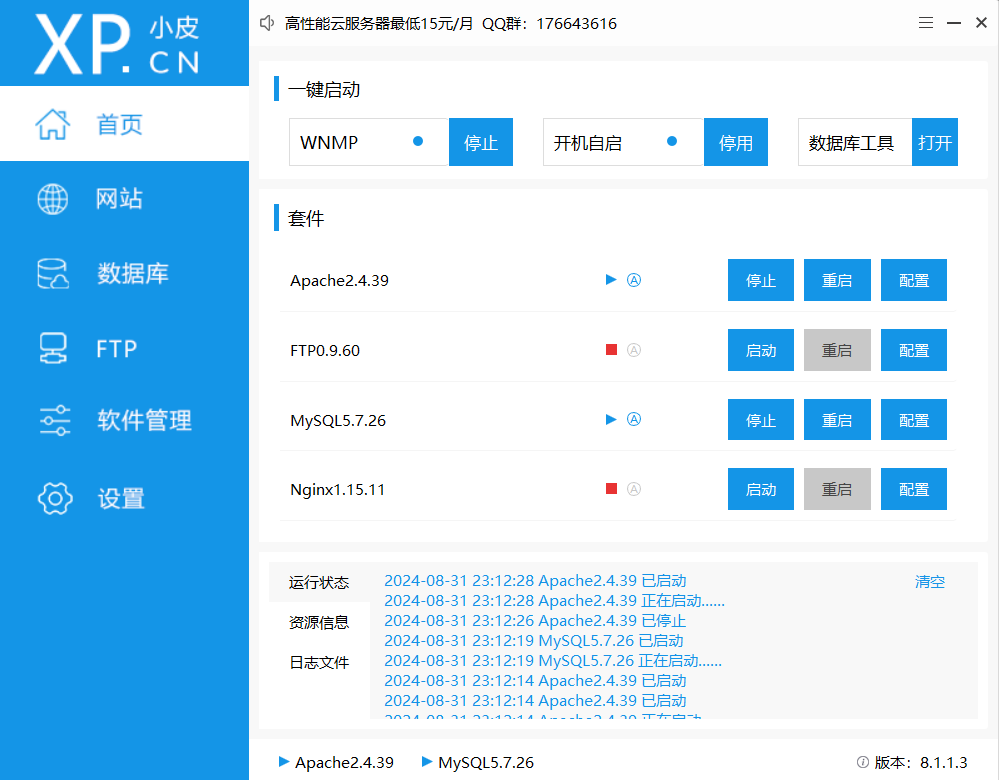
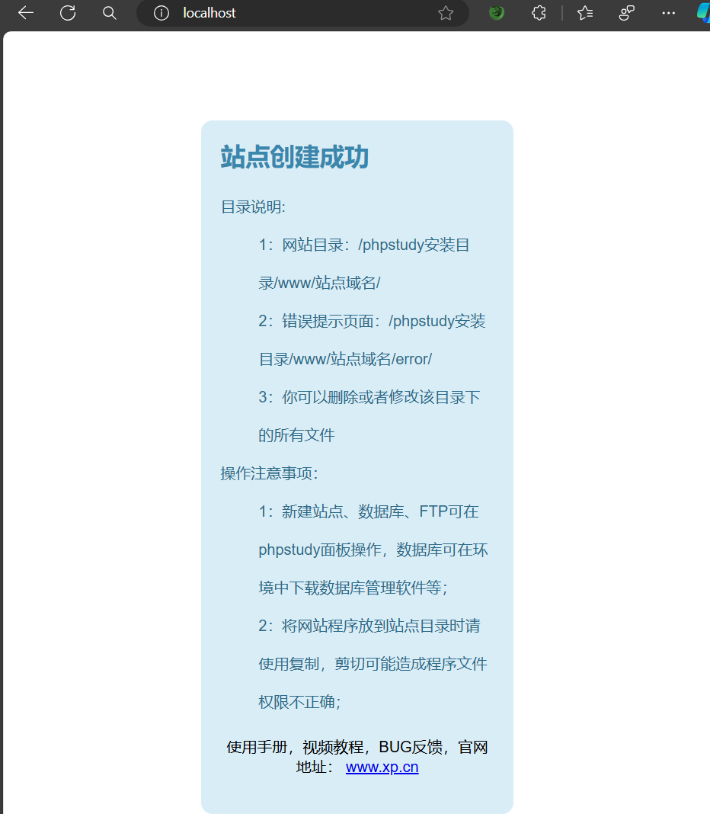
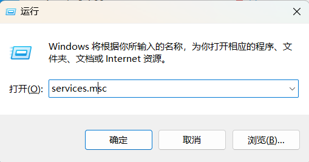
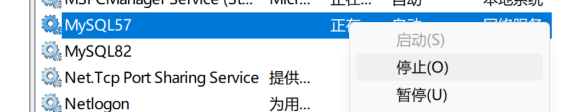
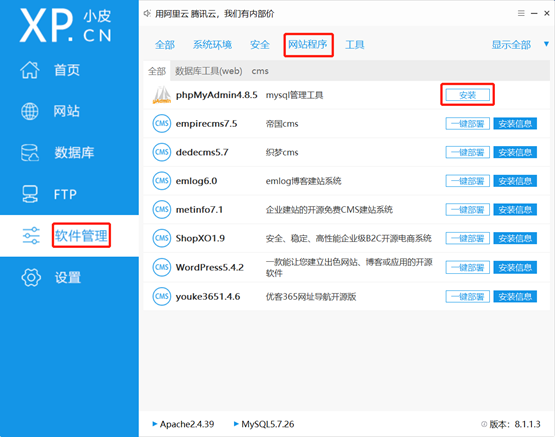
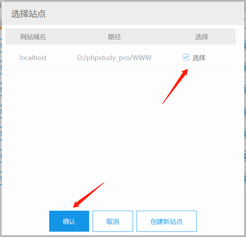

# PhpStudy_pro installation guide

## 一、Introduction
    phpStudy是一款便捷的PHP调试环境集成包，包含最新版的Apache、PHP和MySQL。下载安装包后，无论是从官网还是百度网盘，都可以快速安装。安装过程中可以选择自定义路径，并能轻松更改Apache和MySQL的端口。    
    
    学习网络安全，phpstudy是一个非常不错的选择，可以帮我们在本地快速搭建靶场，进行漏洞挖掘和渗透测试。    

## 二、Download and install

[phpstudy_pro官网下载地址](https://www.xp.cn/php-study)  

    ....     
    
    0.简单的前期安装步骤指定链接下载安装包--->解压安装包--->自定义安装目录  --->启动软件     
    
    1.验证安装：    
    
        1.1.启动Apache服务、MySQL服务，默认Apache版本为2.4.39，MySQL版本为5.7.26      
        
      

        1.2.在浏览器中输入：localhost，如果出现了如下网站界面即安装成功。      
        
     

    2.可能存在问题    
    
        3306端口占用，导致mysql无法启动(点击启动Mysq后自动停止或者提示端口占用)，解决办法：    
        
        （1）win+r ---> services.msc     
        
   

        （2）找到MySQL服务，右键停止服务     
        
    

        （3）重新启动mysql服务     

## 三、Toole installation
    MySql管理攻击安装      
    
        （1）点击软件管理--->网站程序--->phpMyAdmin     
        

        （2）选择安装站点localhost     
        

        （3）登陆phpMyAdmin，默认用户名root，密码为空    
